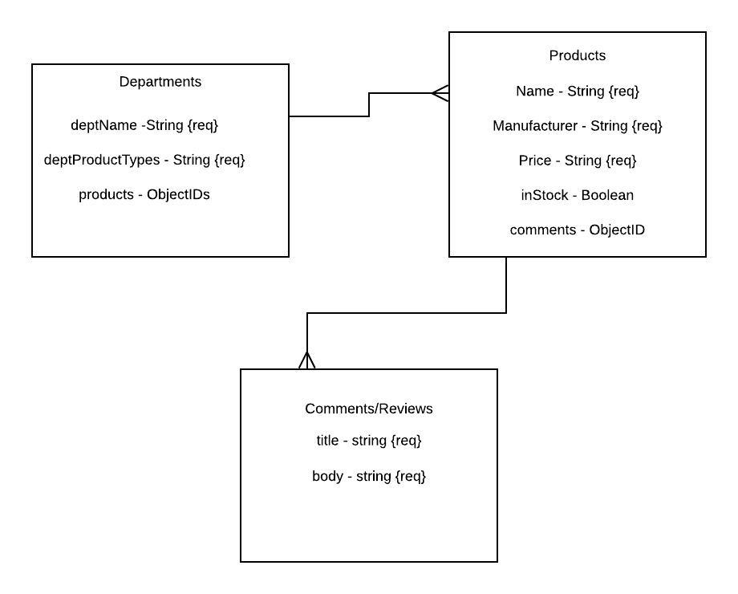
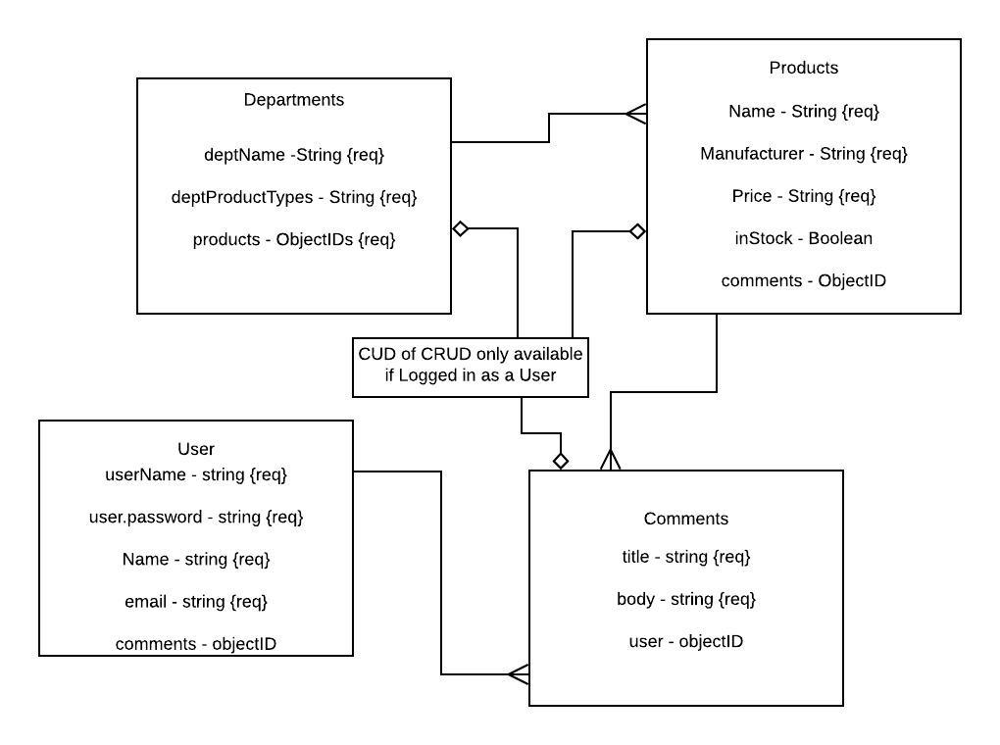
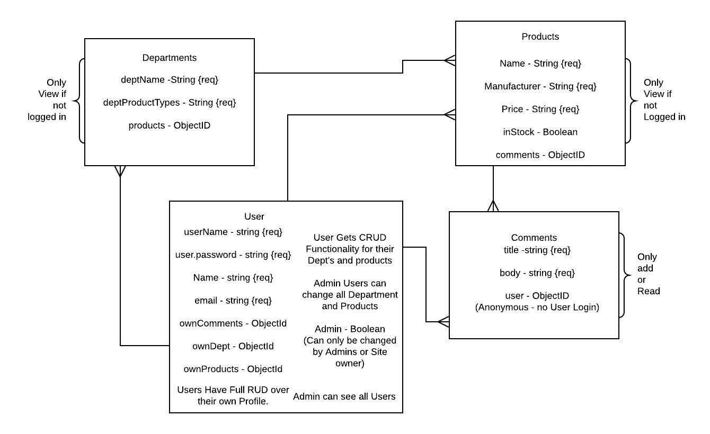

# Department-Stores

User Authentication
--The department store allow user to create a profile
---The profile functionality will include add personal info (just a little bit)
------userName, email, password, including their firstName and LastName 
------(maybe Upload function)
User authentication will be optionalal
---The navbar will have a sign up and a login option

One Store
---multiples departments
--each department will have a list of items

Home Page
--Nav Bar
----Home
----user sign up and login option
----department button that will redirect you to the department that you were at
--Body
---A list of the department
--Footer
---basic nav
---comment section

[User Story](https://trello.com/b/p3yzHCNL)

## Base MVP DB

## Extended MVP DB

## Further Extended DB

